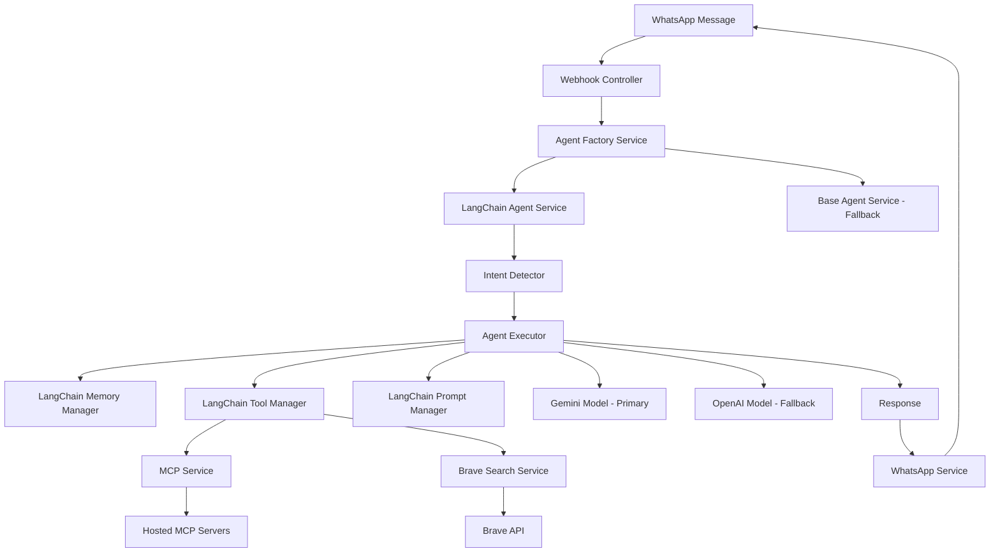
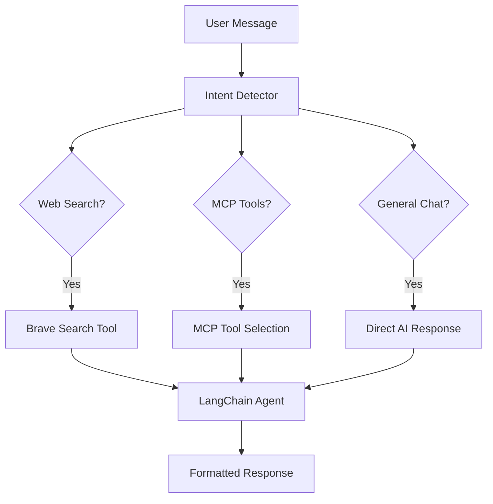

# LangChain.js Integration Design

## Overview

This design integrates LangChain.js into the existing NestJS WhatsApp AI control application to enhance AI agent capabilities with advanced prompt engineering, memory management, and tool orchestration. The integration will create a new LangChain-based agent service that can work alongside or replace the existing BaseAgentService architecture while maintaining full compatibility with hosted MCP servers and WhatsApp webhook functionality.

The design follows LangChain best practices for agent architecture, implementing a clean separation between intent detection, tool management, memory handling, and model execution. The integration will maintain the current model hierarchy where Gemini is the primary model and OpenAI serves as the fallback when Gemini is unavailable.

The LangChain architecture will use native LangChain patterns including AgentExecutor, ChatMessageHistory, and Tool interfaces, providing a more robust and maintainable solution than the current custom agent implementation.

## Architecture

### High-Level Architecture



### Component Relationships

The LangChain integration will introduce several new components while maintaining compatibility with existing services:

1. **LangChainAgentService**: Main orchestrator using LangChain patterns
2. **LangChainMemoryManager**: Handles conversation memory and context
3. **LangChainToolManager**: Manages MCP and Brave search tools
4. **LangChainPromptManager**: Handles prompt templates and strategies
5. **Enhanced AgentFactoryService**: Updated to support LangChain agents

## Components and Interfaces

### 1. LangChain Agent Service

The LangChain agent service follows LangChain best practices using AgentExecutor and native LangChain components:

```typescript
interface ILangChainAgentService extends IAgentService {
  // Core LangChain functionality
  initializeAgent(): Promise<void>;
  createAgentExecutor(modelType: 'gemini' | 'openai'): Promise<AgentExecutor>;
  
  // Model management with fallback
  getPrimaryModel(): ChatGoogleGenerativeAI | ChatOpenAI;
  getFallbackModel(): ChatGoogleGenerativeAI | ChatOpenAI;
  
  // LangChain memory management
  getMemoryForUser(userId: string): ChatMessageHistory;
  clearMemoryForUser(userId: string): void;
  
  // Tool management
  getAvailableTools(): Promise<Tool[]>;
  refreshTools(): Promise<void>;
  
  // Intent detection and routing
  processMessageWithIntent(userId: string, message: string, requestId: string): Promise<string>;
}
```

### 2. Memory Manager

Uses LangChain's native memory management with ChatMessageHistory and conversation buffers:

```typescript
interface ILangChainMemoryManager {
  // LangChain native memory operations
  createMemoryForUser(userId: string): ChatMessageHistory;
  getMemory(userId: string): ChatMessageHistory | null;
  clearMemory(userId: string): void;
  
  // Memory strategies
  createBufferMemory(userId: string): ConversationBufferMemory;
  createSummaryMemory(userId: string): ConversationSummaryMemory;
  
  // Cleanup and maintenance
  cleanupExpiredMemories(): void;
  getMemoryStats(): { totalUsers: number; totalMessages: number };
}
```

### 3. Tool Manager

```typescript
interface ILangChainToolManager {
  // Tool discovery and management
  discoverMCPTools(): Promise<Tool[]>;
  createBraveSearchTool(): Tool;
  getAllTools(): Promise<Tool[]>;
  
  // Tool execution
  executeTool(toolName: string, args: any): Promise<any>;
  
  // Tool schema management
  convertMCPToolToLangChain(mcpTool: MCPTool): Tool;
  validateToolSchema(tool: Tool): boolean;
}
```

### 4. Prompt Manager

```typescript
interface ILangChainPromptManager {
  // Prompt templates
  getSystemPrompt(): PromptTemplate;
  getUserPrompt(context: string): PromptTemplate;
  getToolPrompt(toolName: string): PromptTemplate;
  
  // Dynamic prompt selection
  selectPromptStrategy(messageContext: MessageContext): PromptTemplate;
  
  // Prompt configuration
  updatePromptTemplate(name: string, template: string): void;
  loadPromptsFromConfig(): void;
}
```

### 5. Intent Detector

```typescript
interface IIntentDetector {
  // Intent detection
  detectIntent(message: string, context?: MessageContext): Promise<IntentDetectionResult>;
  
  // Pattern management
  addIntentPattern(intent: string, patterns: string[]): void;
  updateIntentPatterns(patterns: IntentPattern[]): void;
  
  // Tool suggestion
  suggestToolsForIntent(intent: string): string[];
  extractSearchQuery(message: string): string;
}
```

## Data Models

### 1. LangChain Configuration

```typescript
interface LangChainConfig {
  // Model configuration (Gemini primary, OpenAI fallback)
  defaultModel: 'gemini' | 'openai';
  fallbackModel: 'gemini' | 'openai';
  
  // Memory configuration
  memoryType: 'buffer' | 'summary' | 'conversation';
  maxTokens: number;
  memoryExpiryHours: number;
  
  // Tool configuration
  enabledTools: string[];
  toolTimeout: number;
  maxToolCalls: number;
  
  // Prompt configuration
  systemPromptPath?: string;
  promptTemplatesPath?: string;
  
  // Performance configuration
  enableTracing: boolean;
  enableMetrics: boolean;
  cacheEnabled: boolean;
}
```

### 2. Message Context

```typescript
interface MessageContext {
  userId: string;
  messageText: string;
  conversationHistory: ConversationMessage[];
  detectedIntent?: IntentDetectionResult;
  timestamp: Date;
}

interface IntentPattern {
  intent: 'web_search' | 'mcp_tools' | 'general_chat';
  keywords: string[];
  patterns: RegExp[];
  priority: number;
}
```

### 3. Tool Execution Result

```typescript
interface ToolExecutionResult {
  toolName: string;
  success: boolean;
  result?: any;
  error?: string;
  executionTime: number;
  timestamp: Date;
}
```

## Error Handling

### 1. Graceful Degradation Strategy

```typescript
class LangChainErrorHandler {
  // Fallback to base agent service
  async handleLangChainFailure(error: Error, context: MessageContext): Promise<string> {
    this.logger.warn(`LangChain failed, falling back to base agent: ${error.message}`);
    return this.baseAgentService.processMessage(
      context.userId, 
      context.messageText, 
      context.requestId
    );
  }
  
  // Tool execution error handling
  async handleToolError(toolName: string, error: Error): Promise<ToolExecutionResult> {
    return {
      toolName,
      success: false,
      error: `Tool execution failed: ${error.message}`,
      executionTime: 0,
      timestamp: new Date()
    };
  }
  
  // Memory operation error handling
  handleMemoryError(userId: string, operation: string, error: Error): void {
    this.logger.error(`Memory operation ${operation} failed for user ${userId}: ${error.message}`);
    // Continue without memory if needed
  }
}
```

### 2. Circuit Breaker Pattern

```typescript
class LangChainCircuitBreaker {
  private failureCount = 0;
  private lastFailureTime?: Date;
  private readonly threshold = 5;
  private readonly timeout = 60000; // 1 minute
  
  async execute<T>(operation: () => Promise<T>): Promise<T> {
    if (this.isOpen()) {
      throw new Error('Circuit breaker is open');
    }
    
    try {
      const result = await operation();
      this.onSuccess();
      return result;
    } catch (error) {
      this.onFailure();
      throw error;
    }
  }
  
  private isOpen(): boolean {
    return this.failureCount >= this.threshold && 
           this.lastFailureTime && 
           (Date.now() - this.lastFailureTime.getTime()) < this.timeout;
  }
}
```

## Intent Detection and Routing

### Intent Classification System

The system will implement intelligent intent detection to route messages to the appropriate handler:

```typescript
interface IntentDetectionResult {
  intent: 'web_search' | 'mcp_tools' | 'general_chat';
  confidence: number;
  suggestedTools?: string[];
  searchQuery?: string;
}

interface IIntentDetector {
  detectIntent(message: string, context?: MessageContext): Promise<IntentDetectionResult>;
  updateIntentPatterns(patterns: IntentPattern[]): void;
}
```

### Intent Categories

1. **Web Search Intent**
   - Keywords: "search", "latest", "news", "current", "today", "weather", "stock price"
   - Patterns: Questions about current events, real-time data, recent information
   - Action: Route to Brave Search tool

2. **MCP Tools Intent**
   - Keywords: "send email", "schedule", "create", "add to calendar", "list emails"
   - Patterns: Action-oriented requests that require external service integration
   - Action: Route to appropriate MCP tool

3. **General Chat Intent**
   - Default for conversational messages, knowledge questions, explanations
   - Action: Process with AI model directly without tools

### Routing Logic



## Implementation Phases

### Phase 1: Core LangChain Integration
- Install LangChain.js dependencies
- Create basic LangChain agent service
- Implement simple memory management
- Add configuration management

### Phase 2: Intent Detection System
- Implement intent detection service
- Create routing logic for different intents
- Add pattern matching for web search, MCP tools, and general chat
- Integrate intent detection with agent processing

### Phase 3: Tool Integration
- Convert MCP tools to LangChain format
- Integrate Brave search as LangChain tool
- Implement tool execution and error handling
- Add tool discovery and management

### Phase 4: Advanced Features
- Implement sophisticated prompt management
- Add conversation memory strategies
- Add metrics and observability
- Performance optimization

## Configuration Management

### Environment Variables

```bash
# LangChain Configuration
LANGCHAIN_DEFAULT_MODEL=gemini
LANGCHAIN_FALLBACK_MODEL=openai
LANGCHAIN_MEMORY_TYPE=conversation
LANGCHAIN_MAX_TOKENS=4000
LANGCHAIN_MEMORY_EXPIRY_HOURS=24

# Tool Configuration
LANGCHAIN_TOOL_TIMEOUT=30000
LANGCHAIN_MAX_TOOL_CALLS=5

# Intent Detection Configuration
LANGCHAIN_INTENT_CONFIDENCE_THRESHOLD=0.7
LANGCHAIN_DEFAULT_INTENT=general_chat

# Performance Configuration
LANGCHAIN_ENABLE_TRACING=false
LANGCHAIN_ENABLE_METRICS=true
LANGCHAIN_CACHE_ENABLED=true

# Prompt Configuration
LANGCHAIN_SYSTEM_PROMPT_PATH=./prompts/system.txt
LANGCHAIN_PROMPT_TEMPLATES_PATH=./prompts/templates/
```

### Configuration File Structure

```
config/
├── langchain.json          # Main LangChain configuration
├── prompts/
│   ├── system.txt         # System prompt template
│   └── templates/
│       ├── user.txt       # User message template
│       ├── tool.txt       # Tool execution template
│       └── error.txt      # Error handling template
└── tools/
    ├── mcp-tools.json     # MCP tool configurations
    └── brave-search.json  # Brave search configuration
```

## Monitoring and Observability

### Metrics to Track

1. **Performance Metrics**
   - Response time per message
   - Tool execution time
   - Memory usage per user
   - Cache hit/miss rates

2. **Usage Metrics**
   - Messages processed per hour
   - Tool usage frequency
   - Memory operations per user
   - Error rates by component

3. **Business Metrics**
   - User engagement rates
   - Successful task completions
   - Tool effectiveness scores
   - User satisfaction indicators

### Logging Strategy

```typescript
interface LangChainLogEntry {
  timestamp: Date;
  level: 'debug' | 'info' | 'warn' | 'error';
  component: string;
  userId?: string;
  requestId?: string;
  message: string;
  metadata?: Record<string, any>;
  duration?: number;
}
```

## Security Considerations

1. **API Key Management**: Secure storage and rotation of LangChain and model API keys
2. **Tool Access Control**: Validate tool permissions and user access rights
3. **Memory Isolation**: Ensure user conversation memories are properly isolated
4. **Input Validation**: Sanitize all inputs before processing through LangChain
5. **Rate Limiting**: Implement rate limiting for tool executions and API calls
6. **Audit Logging**: Log all tool executions and sensitive operations

## Migration Strategy

### Gradual Rollout Plan

1. **Phase 1**: Deploy LangChain alongside existing system (feature flag controlled)
2. **Phase 2**: Route 10% of traffic to LangChain agent
3. **Phase 3**: Gradually increase to 50% based on performance metrics
4. **Phase 4**: Full migration with base agent as fallback only
5. **Phase 5**: Remove base agent dependency (optional)

### Rollback Strategy

- Maintain base agent service as fallback
- Implement feature flags for instant rollback
- Monitor key metrics for automatic rollback triggers
- Preserve conversation history during transitions